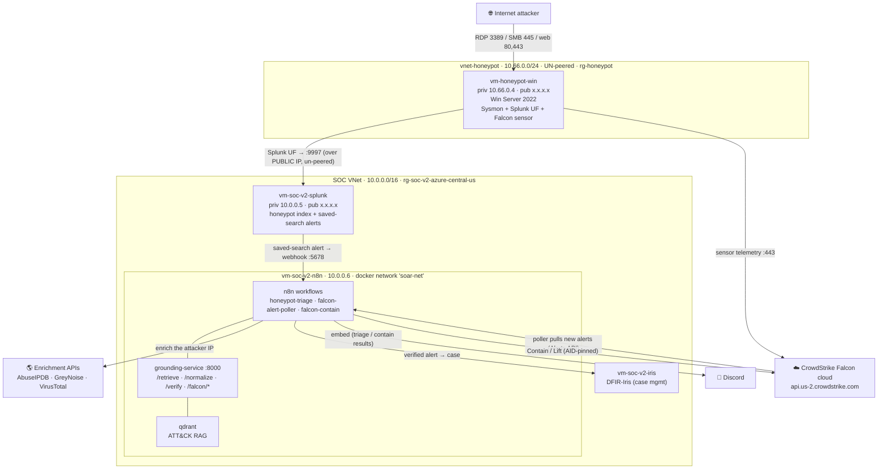

# Honeypot Agentic-SOC

An internet-exposed Windows honeypot gets attacked for real, its logs and EDR detections flow into a SOAR pipeline, Claude Opus triages each alert, a verifier gate plus a second-opinion AI judge decide whether that triage is trustworthy, and it lands as a case in DFIR-Iris with a Discord ping. If the alert is bad enough, the system recommends network-isolating the box through CrowdStrike Falcon.

Nothing here is synthetic. The attacks are real strangers hammering an exposed RDP port.

## The loop at a glance

For the full box-by-box walkthrough, see [ARCHITECTURE.md](infra/honeypot/ARCHITECTURE.md).

## What makes it interesting

- **Verifier-gated AI triage.** Claude Opus writes a structured triage, then a verifier gate plus an advisory AI judge decide whether it is trustworthy before anything downstream acts on it. The AI is instructed to stay grounded; the verifier is what actually enforces it.
- **Real attacks, not synthetic data.** The honeypot is a live, internet-exposed RDP/SMB/web box, so the telemetry is genuine adversary behavior, not lab replays.
- **Two detection sources, one pipeline.** A Splunk saved-search webhook and a CrowdStrike Falcon Alerts-API poller both feed the same n8n triage workflow, so log-based and EDR-based alerts get the same treatment.
- **Autonomous, with a human in the loop for response.** The Falcon poller runs every 15 minutes on its own. Network-isolation (Contain) stays a human-fired action, pinned to the host's Falcon agent ID so it cannot isolate the wrong machine.

## Tech stack

| Layer | Stack |
|---|---|
| Honeypot | Azure Windows Server 2022 + Sysmon + Splunk Universal Forwarder + CrowdStrike Falcon sensor |
| SIEM | Splunk (honeypot index, saved-search alerts) |
| SOAR | n8n (`honeypot-triage`, `falcon-alert-poller`, `falcon-contain`) |
| AI triage | Claude Opus 4.8 via `grounding-service` (`/normalize`, `/retrieve`, `/verify`, `/falcon/*`) |
| RAG | qdrant (MITRE ATT&CK technique embeddings) |
| Verifier | `triage-verifier` (eval harness + verifier gate) |
| EDR | CrowdStrike Falcon (detect-only, plus Contain/Lift response) |
| Case management | DFIR-Iris |
| Enrichment | AbuseIPDB, GreyNoise, VirusTotal |
| Notify | Discord |

## What's shipped

Phase 0 is complete and the autonomous loop is live: the Azure honeypot VM with its telemetry, CrowdStrike Falcon in detect-only mode plus a validated Contain/Lift round-trip, the `grounding-service` pipeline (`/normalize`, `/retrieve`, `/verify`), the `honeypot-triage` workflow running end to end, and the `falcon-alert-poller` polling the Falcon Alerts API every 15 minutes.

## Roadmap

- **Phase 1: Adversarial red-team.** OWASP-LLM Top-10 and MITRE ATLAS payloads against the guardrails, with before-and-after measurement.
- **Phase 2: RAG + detection-as-code.** Claude-drafted Sigma rules on top of the existing ATT&CK RAG corpus.
- **Phase 3: Malware-triage add-on.** File hash to VirusTotal plus Claude static de-obfuscation.
- **Phase 4: splunk-MCP as a first-class Opus tool.**
- **Phase 5: Multi-agent.** Separate enrichment, triage, and escalation agents under a supervisor.

## Repo layout

| Path | What's there |
|---|---|
| [infra/honeypot/ARCHITECTURE.md](infra/honeypot/ARCHITECTURE.md) | The full architecture walkthrough (Layer 1 loop and Layer 2 internals) |
| [infra/honeypot/RUNBOOK.md](infra/honeypot/RUNBOOK.md) | How to operate the system |
| [grounding-service/](grounding-service/) | The Python triage pipeline (normalize, retrieve, verify, Falcon helpers) |
| [triage-verifier/](triage-verifier/) | The verifier gate and eval harness |
| [infra/honeypot/](infra/honeypot/) | Workflow generators, Falcon setup and validation docs, NSG rules, Sysmon config |
| [JSON/](JSON/) | Importable n8n workflow exports |
| [vault/](vault/) | The v1 documentation vault (architecture, ADRs, runbooks, detections) |
| [docs/v1-splunk-n8n-lab.md](docs/v1-splunk-n8n-lab.md) | The v1 story this grew out of |

## Where this came from: the v1 local SOAR lab

This started as a local Splunk + n8n + VMware SOAR lab (the v1 project), built from the MyDFIR tutorial and then extended with structured outputs, an escalation gate, and detection foundations. It was re-architected into this cloud-native, autonomous, agentic honeypot SOC. The full v1 writeup is preserved at [docs/v1-splunk-n8n-lab.md](docs/v1-splunk-n8n-lab.md).

## Attribution

Original tutorial inspiration: MyDFIR (Stephen), *SOC Automation Project 2.0* video series (on YouTube). This repo extends that foundation into the agentic-honeypot direction: an internet-exposed honeypot, CrowdStrike Falcon EDR, verifier-gated Claude Opus triage, and an autonomous poll loop.

## License

MIT. See [LICENSE](LICENSE).
