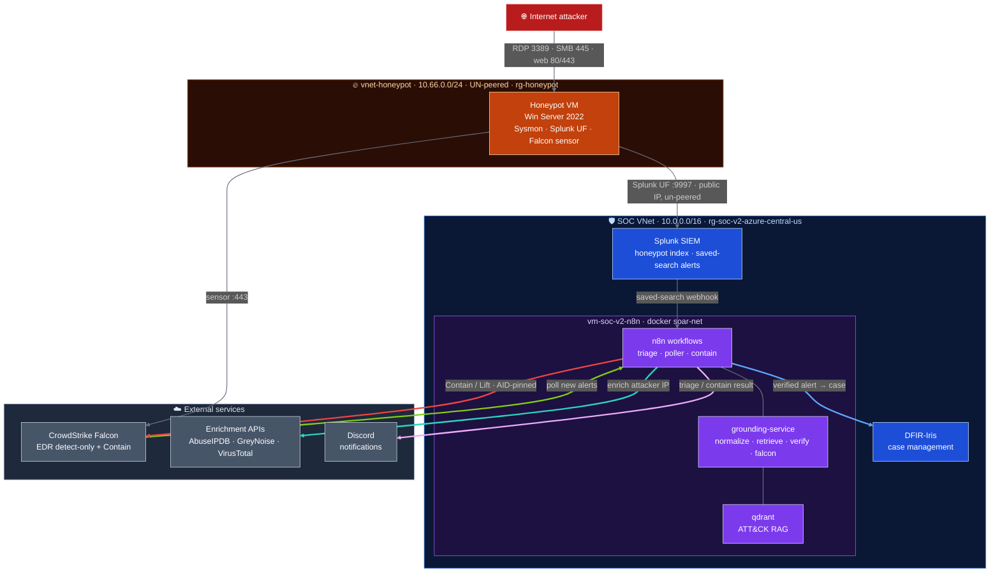
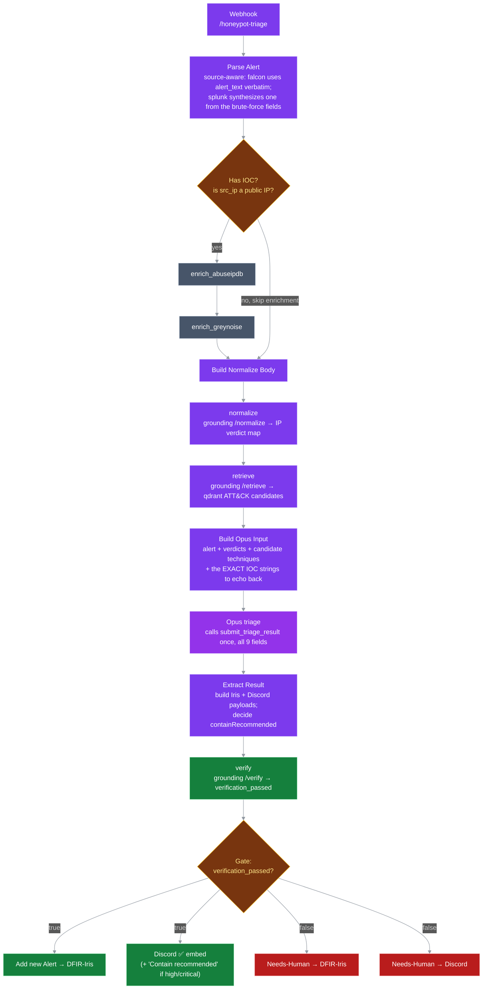
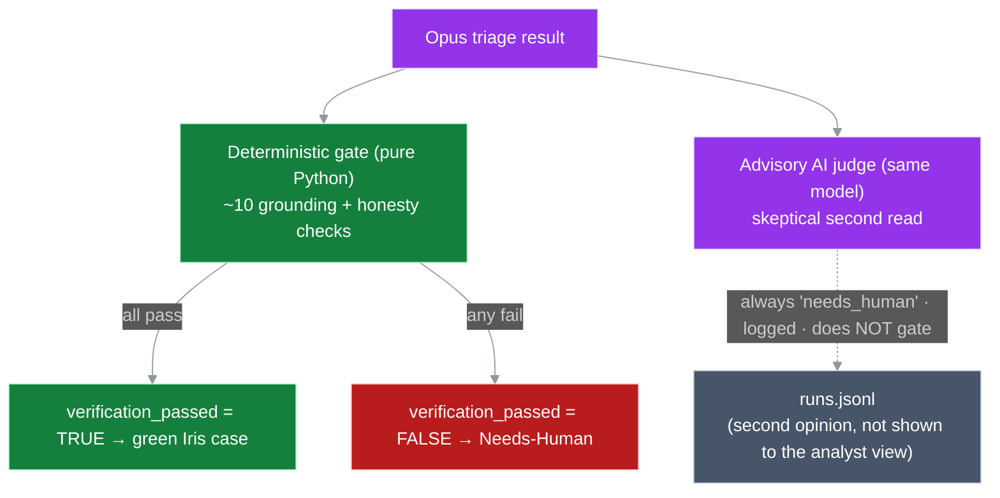
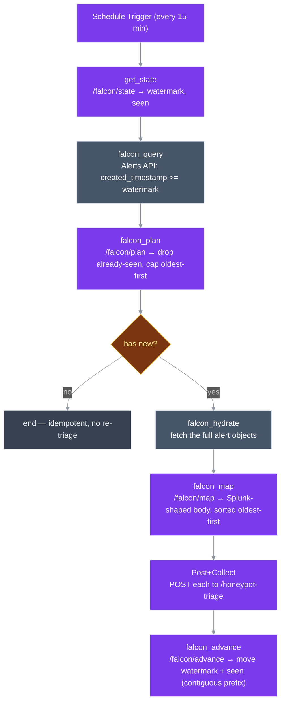
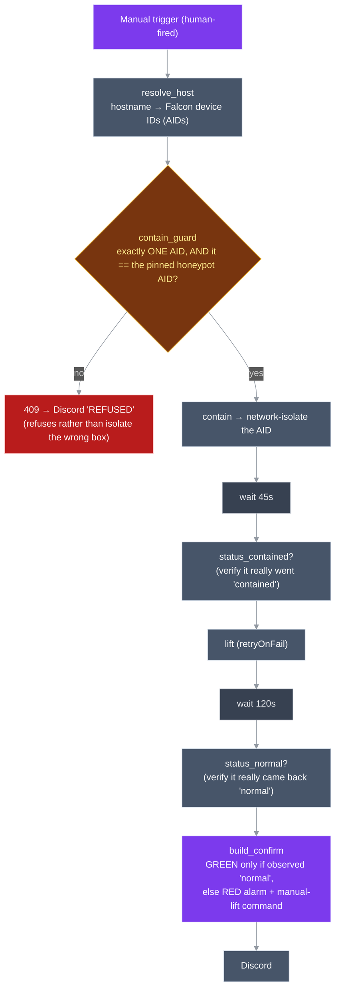

# How this whole thing works (architecture + walkthrough)

This is the "what connects to what, and why" doc for the honeypot agentic-SOC lab. It's written to be
read top-to-bottom — first the 30,000-ft loop (Layer 1), then we crack open each box (Layer 2).

The one-liner: **an internet-exposed Windows honeypot gets attacked for real → its logs + EDR detections
flow into a SOAR pipeline → Claude Opus triages each alert → a verifier gate (plus a second-opinion AI
judge) decides if the triage is trustworthy → it lands as a case in DFIR-Iris + a Discord ping → and if
it's bad enough, the system recommends network-isolating the box via CrowdStrike.**

Nothing here is synthetic. The attacks are real strangers hammering an exposed RDP port.

---

## Layer 1 — the whole loop (the part you'd point at in a demo)

> The colours here are only for visual clarity: they group related parts and make each connection easier to trace. They do not indicate good vs. bad, or safe vs. risky.

### The cast (who's who, and where they live)

| Player | Lives on | Job |
|---|---|---|
| **vm-honeypot-win** | `rg-honeypot`, its own un-peered VNet (`10.66.0.0/24`) | The bait. Exposed RDP/SMB/web. Runs Sysmon (deep process logging), the Splunk forwarder, and the Falcon sensor. |
| **vm-soc-v2-splunk** | SOC VNet `10.0.0.5` (public `x.x.x.x`) | The SIEM. Receives honeypot logs into the `honeypot` index; saved searches fire alerts. |
| **vm-soc-v2-n8n** | SOC VNet `10.0.0.6` | The brain box. Runs n8n (the workflows) + `grounding-service` + `qdrant`, all in Docker on the `soar-net` network. |
| **grounding-service** | container on the n8n box, port 8000 | The Python "smarts": MITRE retrieval, enrichment normalizing, the verifier gate, and the Falcon poller helpers. |
| **qdrant** | container on the n8n box | Vector DB holding the ATT&CK technique embeddings (the RAG part). |
| **vm-soc-v2-iris** | SOC VNet | DFIR-Iris — where triaged alerts become trackable cases. |
| **CrowdStrike Falcon** | SaaS (`us-2`) | The EDR. Sensor detects on the host (detect-only); the cloud API feeds detections in and runs Contain/Lift. |
| **Enrichment APIs / Discord** | external SaaS | AbuseIPDB/GreyNoise/VT score the attacker IP; Discord is the human notification. |

### How a real attack actually flows through

1. **Someone on the internet attacks the box.** RDP brute force is the bread-and-butter (the NSG deliberately
   exposes 3389/445/80/443). This is real traffic — dozens of source IPs a day.
2. **Two sensors are watching the same box.** Sysmon + Windows Event Logs get shipped by the Splunk **Universal
   Forwarder** to Splunk, and the **Falcon sensor** independently reports to the CrowdStrike cloud. Two different
   "eyes" — one log-based (Splunk), one EDR-based (Falcon).
3. **Two ways an alert enters triage — both end up at the same n8n webhook.**
   - **Splunk path:** a saved search (e.g. "lots of failed logons") fires and POSTs to the n8n `honeypot-triage`
     webhook (`10.0.0.6:5678`).
   - **Falcon path:** the `falcon-alert-poller` workflow polls the Falcon Alerts API every 15 min, maps any new
     detection into the same shape, and POSTs it to that *same* webhook.
4. **The brain box triages it.** Inside `honeypot-triage`: parse the alert → enrich the attacker IP (AbuseIPDB /
   GreyNoise / VT) → pull candidate MITRE techniques from qdrant → hand all that to **Claude Opus** to write a
   structured triage → run it through the **verifier gate** (+ the advisory AI judge) → if it passes, open a
   **DFIR-Iris** case and ping **Discord**.
5. **If it's bad enough, recommend pulling the plug.** When a verified alert is high/critical, the Discord embed
   says *"⚠️ Contain recommended."* A human then fires `falcon-contain`, which tells CrowdStrike to
   network-isolate that exact host (pinned to its Falcon agent ID so it can't isolate the wrong machine), waits,
   then lifts containment back to normal.

### Three things worth knowing up front (they trip people up)

- **The honeypot can't talk to the SOC network directly.** Its VNet is **un-peered** on purpose, and the egress
  NSG explicitly *denies* `10.0.0.0/8`. So how do logs get to Splunk? The forwarder ships to Splunk's **public**
  IP (`x.x.x.x:9997`), with a matching allow-rule. The honeypot is treated as hostile — it never gets a
  private path into the real infrastructure.
- **Once it's "owned," the box can only reach 3 things.** The egress rules lock outbound to Splunk:9997, DNS, and
  web 80/443 — then deny everything else. No reverse shells on weird ports, no mining pools, no scanning. The
  web:443 rule is doing double duty: it's how the Falcon sensor phones home *and* it captures any C2-over-HTTPS.
- **Falcon is in detect-only mode.** We *want* the attack to fully play out so we get rich telemetry, so Falcon
  watches and reports but doesn't block. That's why an attacker can actually get somewhere — by design.

> **Trial clock:** the CrowdStrike Falcon trial expires **2026-07-28** (extended from an initial 2026-07-13). Anything that needs the live Falcon API
> (the poller pulling real detections, the `falcon-contain` round-trip) has to be demoed/recorded before then.

---

## Layer 2 — inside the boxes

### 2a — the triage pipeline (`honeypot-triage`)

This is the workflow every alert runs through, no matter which feeder sent it. Generated from
`infra/honeypot/build_honeypot_triage_workflow.py` (that Python file is the source of truth —
`JSON/honeypot-triage.json` is the importable output).

**The big idea: everything is pre-chewed before Opus ever sees it.** Opus does NOT call tools to go fetch
enrichment or look up techniques. n8n does all of that first (enrich the IP, pull the candidate techniques),
then hands Opus a tidy package and says "reason over this, give me one structured answer." That keeps it
cheap, predictable, and loop-free — Opus's only tool call is the final `submit_triage_result`.

Node by node:
- **Parse Alert** — normalizes whatever came in. It's *source-aware*: a `falcon` alert already has a good
  `alert_text`, so it uses it verbatim; a `splunk` brute-force alert gets an `alert_text` synthesized from its
  fields. Either way it pulls out the `src_ip`, host, user, etc.
- **Has IOC?** — a cheap gate: only bother enriching if there's a real, public attacker IP. RFC1918/empty IPs
  skip straight past enrichment. (This is exactly what lets a no-IOC alert like an EICAR test-file detection
  flow through cleanly instead of erroring on an empty lookup.)
- **enrich_abuseipdb → enrich_greynoise** — score the attacker IP. AbuseIPDB gives a confidence/malicious
  read; GreyNoise tells you mass-scanner vs. targeted (the key honeypot signal).
- **normalize** — turns the two raw API blobs into a clean `{ip → verdict}` map the rest of the pipeline can use.
- **retrieve** — semantic search over the ATT&CK corpus in qdrant, using the alert text. Returns the candidate
  MITRE techniques Opus is *allowed* to cite (more on that leash in 2b).
- **Build Opus Input** — assembles the user message: the alert, the enrichment verdicts, the candidate
  techniques, and the **exact IOC strings** Opus must echo verbatim (so it can't paraphrase an IP and break
  grounding).
- **Opus triage** — the forked "Tier-1 SOC analyst" prompt. It must call `submit_triage_result` exactly once,
  with all 9 fields, citing techniques **only** from the candidate list and echoing **only** the enrichment
  verdicts it was handed. The anti-hallucination leash starts here, in the prompt, before the verifier even runs.
- **Extract Result** — pulls the tool call out, back-fills any benign missing field, and builds the downstream
  payloads: the Iris case body, the malicious/suspicious IOCs to attach, the Discord embed, and the `verify`
  request. **This is also where `containRecommended` is decided** — simply `source == 'falcon' && severity is
  high/critical`.
- **verify** — hands the triage to `grounding /verify`, which runs the credibility gate (Layer 2b) and returns
  `verification_passed`.
- **Gate** — the fork in the road. Passed → open a real Iris case + green Discord embed (with the "Contain
  recommended" line if it's high/critical). Failed → route to **Needs-Human** instead (a flagged Iris case +
  a red Discord embed) so nothing untrustworthy is silently trusted.

### 2b — the verifier gate + the advisory judge

**Why this exists:** an LLM will happily write a confident, fluent, *wrong* triage — cite a technique that
doesn't exist, call an IP malicious when the enrichment said clean, scream "critical" off a single log line.
The verifier is the answer to that. It's a **pure, deterministic, fully-tested gate** (`triage-verifier/`)
that checks every claim in the triage traces back to something real *before* the triage is trusted. It's the
project's primary hallucination control — and because it's plain Python, it's testable (that's the
`test_falcon.py` / `test_verifier.py` suite you saw go green today), not another AI you have to take on faith.

The deterministic checks, grouped by what they're really asking (`triage-verifier/triage_verifier/verifier.py`):

| Group | Checks | The question it answers |
|---|---|---|
| **Structure** | `schema_valid` | Is it even the right shape, with valid enums? |
| **IOC grounding** | `iocs_enriched_grounded`, `ioc_type_consistent`, `verdict_sourced`, `enrichment_grounded` | Did it only enrich IOCs we actually observed? Is an "ip" shaped like an IP? Does a "malicious" call name its source — and does that verdict **match what enrichment actually returned**? |
| **MITRE grounding** | `mitre_id_exists`, `mitre_name_match`, `mitre_tactic_valid`, `mitre_in_retrieved` | Is the technique real, named correctly, with the right tactic — and was it actually in the candidate set we offered? (No citing something off-menu.) |
| **Honesty** | `severity_supported` | No "high/critical" unless a malicious/suspicious IOC **or** a hot tactic (credential-access, lateral-movement, exfiltration, impact, C2) backs it up. |

**The deterministic gate is what actually decides pass/fail.** All checks green → `verification_passed = true`
→ green path. Any fail → Needs-Human. No LLM in that decision.

**The advisory judge is the second pair of eyes.** It *is* an LLM (same model), it reads the triage and writes
a skeptical critique — but it's **advisory only**: it never flips `verification_passed`, it's logged to
`runs.jsonl`, and by design (§5.7) it **always returns `needs_human`**. Think of it as a senior analyst who
always says "yeah, a human should still glance at this," catching the squishy stuff the deterministic checks
structurally can't see — an incoherent story, an overstated rationale, a technique that's *technically* valid
but a stretch.

**You saw exactly this split today.** Both your runs *passed the deterministic gate* (grounding was clean —
real technique, real malicious IP, sourced verdict). But on run 281 the **judge** caught that the alert text
said "sustained brute force" while `count` was `1` — a coherence problem no grounding check can see, because
"count vs. narrative" isn't a grounding violation. On run 282 (the coherent version), the judge relaxed to
nitpicks. That's the two layers doing their two different jobs.

> **Known gap (spec'd, not wired):** §5.7 also calls for a **bounded re-ground** — if a cited technique isn't
> in the retrieved set, fetch it by ID once before failing. The live n8n workflow **skips** that (a miss goes
> straight to Needs-Human). It's honest Phase-0 debt, not a later phase.

### 2c — the Falcon poller (`falcon-alert-poller`)

Splunk *pushes* (a saved search calls the webhook). Falcon has no webhook to push from, so we **pull**: a
9-node n8n workflow that wakes up every 15 minutes, asks the Falcon API "anything new?", and feeds whatever it
finds into the *same* `honeypot-triage` webhook. It's purely a feeder — everything downstream is identical to
the Splunk path. Generated from `infra/honeypot/build_falcon_poller_workflow.py`.

**It's stateful, so it triages each alert exactly once.** Two bits of state (`{watermark, seen}`) live on the
grounding-service volume (so they survive container restarts *and* VM deallocation):
- **`watermark`** = "don't look at anything created before this timestamp" — the high-water mark of what we've
  processed.
- **`seen`** = the exact alert IDs we've already handled — belt-and-suspenders dedup so the inclusive `>=`
  filter re-pulling a boundary alert doesn't double-triage it.

That's why, when you re-ran things today, the poller saw EICAR again, recognized it via `seen`, and did
nothing — `has new? → no → end`. Idempotent by design.

**The war story (why the query filter looks half-finished):** we *wanted* to scope the query by host **and**
timestamp — a compound FQL filter, which CrowdStrike joins with a literal `+`. Turns out n8n 2.21.7 / the
HTTP node **physically cannot transmit that `+`**:
- send it as a query parameter → the gateway turns `+` into a space → `total: 0` (matches nothing).
- jam `%2B` into the URL field → n8n re-encodes it to `%252B` → `400 invalid filter`.

Either way, dead. So we **dropped the host-scope** and filter by `created_timestamp` alone. It's safe here
because the tenant is honeypot-only (nothing else to accidentally scoop up) and Contain is AID-pinned anyway.
Proven `total: 1` against the live EICAR detection. Sometimes the "right" design loses to what the tool can
actually put on the wire.

**Two correctness details worth knowing** (both from the adversarial review):
- **`falcon_advance` only moves the watermark across the *contiguous leading run* of successful POSTs.** If
  alert #2 in a batch fails to post, the watermark stops at #1 — so #2 gets retried next tick instead of being
  silently skipped past. No lost alerts.
- **`falcon_map` sorts oldest-first**, because CrowdStrike's "fetch full objects" endpoint doesn't preserve
  request order, and that contiguous-prefix logic only works if the batch is actually in time order.

**And the thing you shipped today (#10):** if the state is ever empty (fresh volume, skipped seed), the
watermark would be `""`, making the filter `created_timestamp:>=''` → a `400` *every single tick*, silently,
forever. Now that the poller is **active and unattended**, that's a real foot-gun — so `load_state` now
defaults an empty watermark to `now − 24h`. Small fix, but it's the difference between "polls cleanly on a
fresh start" and "silently dies and nobody notices."

### 2d — `falcon-contain` (the response action)

This is the only part that *reaches out and changes the world* — it tells CrowdStrike to network-isolate the
honeypot (cut all traffic except Falcon's own management channel), then lift it back. Generated from
`infra/honeypot/build_falcon_contain_workflow.py`.

Three design choices carry the whole thing:

- **It's human-fired, on purpose.** Containment cuts a real machine off the network — destructive enough that
  the pipeline only ever *recommends* it (the "Contain recommended" line); a person pulls the actual trigger.
- **The AID-pin is the safety rail — the hostname is NOT trusted as the boundary.** `contain_guard`
  (`falcon.py:select_contain_aid`) demands two things: the hostname resolves to **exactly one** device, and
  that device's agent ID **equals a pre-pinned AID**. If hostname lookup ever returns the wrong box, or two
  boxes, or zero — it **refuses** (409 → a "REFUSED" Discord ping) instead of isolating something it shouldn't.
  The pin, not the name, is what bounds the blast radius. (The pinned AID lives only in the gitignored
  `.env` — never in the workflow JSON or git.)
- **It verifies instead of assuming.** It checks the box actually reads `contained` after containing, and
  actually reads `normal` after lifting. The final confirm goes **green only on an observed return to normal** —
  otherwise it fires a **red alarm with the manual-lift command**. No false all-clears.

That last rule earned its keep during validation: the first run waited only 30s after lifting, but CrowdStrike's
lift takes longer than that — so `build_confirm` correctly *refused* to say "all clear" and raised the red
alarm. We bumped the wait to **120s**. The system would rather alarm than lie, which is exactly what you want
from an auto-response.

> The human path contains **and** self-lifts in one run, so you never strand the honeypot offline. A fully
> automatic **watchdog/auto-lift** was deliberately **deferred** — a naive one is racy (a 15-min tick could lift
> a containment a human just started). If overnight auto-heal is ever wanted, it belongs *off* n8n.

---

## That's the whole map

End to end: **real attacker → honeypot (Sysmon + Falcon) → Splunk and/or the Falcon poller → one triage
pipeline (enrich → RAG → Opus → verifier gate + advisory judge) → DFIR-Iris case + Discord → human-fired
Contain with an AID-pin safety rail.** Two feeders, one brain, a deterministic guardrail with an AI second
opinion, and a response action that refuses to hurt the wrong box.

### Where to go deeper (the canonical docs)
- **State of the build:** `infra/honeypot/session-logs/HANDOFF.md` (the 🟢 0D-2 block).
- **Build runbooks:** `falcon-poller-build.md`, `honeypot-triage-build.md`, the `build_*_workflow.py` generators.
- **Evidence:** `falcon-0d2-validation.md` (incl. §6, today's synthetic Contain-recommended run).
- **The guardrail code:** `triage-verifier/triage_verifier/verifier.py` + `constants.py`; `grounding-service/`.
- **Infra / network:** `README.md`, `nsg-rules.md`, `RUNBOOK.md`.
