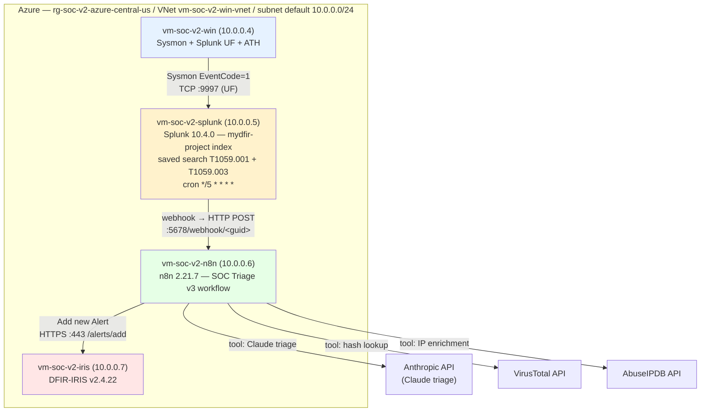

# Current System State

The lab as it exists today, **post-P2 (Azure Port shipped 2026-05-26)**. Splunk, n8n, and DFIR-IRIS now run on Azure IaaS VMs in `rg-soc-v2-azure-central-us` (Central US); the Windows endpoint (`vm-soc-v2-win`) has been in Azure since Phase 1 (2026-05-22). All 4 local-VMware VMs were decommissioned during P2 Tasks 20–23 and archived to `F:\VMs\`.

History: D1 (Detection Foundations) shipped 2026-04-30 on the local lab; v1 rebuild 2026-05-12 (n8n + IRIS post-OneDrive incident); Phase 1 Azure-Windows + Sentinel 2026-05-22; P2 Azure-Linux port 2026-05-23 → 2026-05-26.

## Hosts (post-P2 Azure)

All 4 VMs in `rg-soc-v2-azure-central-us`, VNet `vm-soc-v2-win-vnet` / subnet `default` (`10.0.0.0/24`). Auto-shutdown 11 PM Eastern. Public IPs are NSG-restricted to home IP `x.x.x.x/32`.

| Host | Public IP | Private IP | Size | Role |
|---|---|---|---|---|
| `vm-soc-v2-win` | `x.x.x.x` | `10.0.0.4` | Standard_D4as_v7 (Phase 1) | Endpoint generating telemetry. Sysmon 15.20 + SwiftOnSecurity config (channel `Microsoft-Windows-Sysmon/Operational`), Splunk UF 10.4.0 (LocalSystem), Atomic Red Team (when installed). Also runs Azure Monitor Agent → Sentinel/Log Analytics (Phase 1 parallel path). |
| `vm-soc-v2-splunk` | `x.x.x.x` | `10.0.0.5` | Standard_D4s_v3 | Splunk Enterprise **10.4.0** (Developer License, 10 GB/day, expires 2026-11-19). Web UI :8000, management API :8089, receiver :9997. Indexes: `mydfir-project`. |
| `vm-soc-v2-n8n` | `x.x.x.x` | `10.0.0.6` | Standard_D2s_v3 | n8n **2.21.7** via `docker compose` plugin v5.1.4 on Ubuntu Server 24.04. Web UI :5678. Auth: native user management (deprecated `N8N_BASIC_AUTH_*` not used). |
| `vm-soc-v2-iris` | `x.x.x.x` | `10.0.0.7` | Standard_D2s_v3 | DFIR-IRIS **v2.4.22** (commit `f75e56fb`) via `docker compose`. Web UI :443 (HTTPS, self-signed). 5 containers: db, app, nginx (healthchecked), rabbitmq, worker. |

Phase 1 also provisioned a Log Analytics workspace (`law-soc-v2-azure`, ID `<workspace-id>`) with the SecurityInsights solution; that path is independent of the SOAR pipeline and feeds the deferred Phase 3 Microsoft-native rewrite.

## Archived local VMs (decommissioned P2 Tasks 20–23)

Post-decom VMDK archives at `F:\VMs\` (lift-and-shifted, then deleted from `C:\VMs`):

- `F:\VMs\MyDFIR-Splunk\` (was `192.168.129.131`)
- `F:\VMs\MyDFIR-n8n-VM-v2\` (was `192.168.129.132`)
- `F:\VMs\MyDFIR-DFIR-IRIS-VM-v2\` (was `192.168.129.133`)
- `F:\VMs\MyDfir-Windows10-v2\` (was `192.168.129.130`, hostname `DESKTOP-VNEF7PC`)

Three out-of-scope VMs remain in `C:\VMs\` (separate from the SOC pipeline; not decommissioned): `MyDfir-FlareVM`, `MyDfir-Remnux`, `MyDfir-Zeek-Suricata`.

P2 reclaimed +112.1 GB of C: drive space (49.6 → 161.7 GB), the original blocking driver for the port.

## Data flow (P2 — Azure IaaS)

**Pipeline behavior:**
- Sysmon EventCode=1 events ship sub-second from UF on `vm-soc-v2-win` to the Splunk indexer on `vm-soc-v2-splunk:9997` (intra-VNet, private IPs).
- Saved searches `T1059.001 - PowerShell Encoded Command` (enabled) and `T1059.003 - Suspicious cmd.exe IOC References` (enabled, back-ported 2026-05-26) run every 5 minutes. On match, each fires a webhook to `http://10.0.0.6:5678/webhook/db7245f7-8451-4bea-b47d-f6ad35b818cd` (n8n private IP).
- n8n workflow `SOC Triage v3` invokes Claude (Opus 4.7) via Anthropic API with three agentic tools available: `lookup_file_hash_virustotal` (VT), `enrich_ip_abuseipdb` (AbuseIPDB), and `submit_triage_result` (A1's structured-output tool).
- The "Add new Alert" node uses the `n8n-nodes-dfir-iris` community node v2.0.3 (P2 deviation from v1's hand-registered custom credential) to call `POST /alerts/add` on IRIS at `https://10.0.0.7` over the VNet.
- IRIS alert lands with Claude's prose summary + structured severity, MITRE techniques, and (when populated) IOCs. **Human approval gate is HERE** — analyst reviews in IRIS and clicks "Escalate to Case" manually (ADR 0007). Slack is no longer in the workflow.

**Latency observed (D2s_v3, 2026-05-26 IOC-rich fire):** ~16–23 s active processing (saved-search dispatch → IRIS alert visible), up to 5 min cron wait dominates total. See [[../subprojects/2026-05-23-azure-port/comparison-latency]].

## Interactive investigation path

Independent of the alert pipeline:
- Claude Desktop and Claude Code both have a `splunk` MCP server (v1 era) — **needs P2 reconfiguration** to point at `x.x.x.x` / `10.0.0.5:8089` and re-create the `mcpuser` account on the Azure Splunk. Tracked at [[../subprojects/2026-05-23-azure-port/notes]] follow-ups and noted in [[components/splunk-mcp]] header.
- `mydfir` admin REST access works against Azure Splunk's `:8089` (use `https://10.0.0.5:8089` from intra-VNet, or `https://x.x.x.x:8089` if it gets opened to home IP — currently NSG-restricted to internal traffic).

## Detection inventory

| Technique | Status | Worked example? |
|---|---|---|
| T1059.001 PowerShell Encoded Command | ✅ Active saved search on Azure Splunk; validated end-to-end on Azure 2026-05-25 (P2 Task 19) | Yes — see [[../detections/t1059-001-powershell-encoded]] |
| T1059.003 Suspicious cmd.exe IOC References | ✅ Active saved search on Azure Splunk; validated end-to-end with full IOC enrichment 2026-05-26 (P2 Task 24 prep) | Captured at [[../subprojects/2026-05-23-azure-port/notes]] Task 24 prep; sibling vault page not yet authored |

D1 deliberately scoped to a single vertical-slice technique. T1059.003 was added 2026-05-19 for the demo recording and back-ported to Azure 2026-05-26. Additional detections are future sub-project scope (D-series).

## Sub-projects shipped

| Sub-project | Date shipped | Summary |
|---|---|---|
| A1 — Structured Outputs | 2026-04-28 | `submit_triage_result` tool + `Extract Triage Result` Code node; programmatic IOC + severity routing |
| A2 — Iris Escalation Gate | 2026-04-30 | Slack-interactive Wait-resume gate, additive `ioc_type` schema (ADR 0005); **retired by ADR 0007** but design preserved in vault |
| D1 — Detection Foundations | 2026-04-30 | Sysmon + ART + observation lab; T1059.001 worked example. Re-validated 2026-05-12 on rebuilt lab; re-validated again on Azure 2026-05-25. |
| Phase 1 — Azure foundation | 2026-05-22 | Sentinel + Log Analytics + `vm-soc-v2-win` + AMA + DCR + T1059.001 KQL detection. Parallel telemetry path to Splunk. |
| **P2 — Azure Port (v1 → Azure IaaS)** | **2026-05-26** | **Lift-and-shift v1 SOAR stack to Azure IaaS. 3 new Linux VMs (Splunk + n8n + IRIS), v1 stack decommissioned + archived to F:\\VMs. Primary driver: C: drive recovery (+112.1 GB). See [[../subprojects/2026-05-23-azure-port/README]].** |

Active sub-project: **none** — P2 closed 2026-05-26.

Next planned: **Phase 3 — Microsoft-native SOAR rewrite** (Logic Apps + Sentinel-native incidents replacing n8n + IRIS). Full spec + plan exist on the `v3-microsoft-native` branch — `v2-azure/specs/2026-05-23-phase-2-soar-logic-app-design.md` and `v2-azure/plans/2026-05-23-phase-2-soar-logic-app-plan.md` (both labeled "Phase 2" historically; conceptually Phase 3 under the post-reversal numbering).

A3 Enrichment Expansion remains permanently deferred — likely dropped if Phase 3 delivers more portfolio value than additional v1 enrichment.

## Known issues in the current workflow

Inherited / re-confirmed across the v1 → P2 transitions:

1. **Webhook is unauthenticated** — security-through-obscurity GUID path only; anyone reachable on n8n's port 5678 can POST fake alerts. NSG rule `allow-webhook-from-splunk` limits the inbound surface to `10.0.0.5/32` on the VNet side, mitigating but not eliminating the issue. ADR 0007 doesn't change this; full auth deferred since v0.
2. **`alert_status_id=1` maps to "Unspecified"** on IRIS v2.4.22, not "New" as historically documented in [[components/dfir-iris]]. Cosmetic for portfolio use; workflow's hardcoded value should be re-derived from `/manage/alert-status/list`. Persists in P2 (Azure IRIS is also v2.4.22, same commit).
3. **Severity-stamping inconsistency** persists in v3 and P2. Claude's structured `severity` field occasionally diverges from technique-class risk. Hypothesis: Claude is severity-rating based on decoded-payload benignness rather than technique class. Re-observed during P2 Task 24 IOC fire (T1059.003 with EICAR + Tor exit returned `severity=low` because Claude judged the event as synthetic). System-prompt tuning issue, not wiring. Deferred.
4. **`Splunk_TA_windows` lookup CSVs missing** — historical, may also affect the Azure Splunk install. Three `Could not load lookup=LOOKUP-*_for_windows` warnings appear on most searches. Cosmetic — apply to `wineventlog` sourcetype, not Sysmon. Fix during a future Splunk-add-on hygiene pass.
5. **AtomicTestHarnesses module install missed on `vm-soc-v2-win`**. The Win VM was migrated forward from local Win10's setup without ATH; Atomic Red Team uses synthetic `powershell.exe -EncodedCommand` and `cmd.exe /c ...` invocations instead (covers T1059.001 and T1059.003 SPL matches). Install if/when more authentic ParentImage values are needed.
6. **Empty structured `iocs[]` in IRIS alerts despite IOCs in prose** — new finding 2026-05-26. When Claude judges an event as synthetic (demo-GUID, EICAR hash, `.invalid` URL), it suppresses structured IOC output while still naming IOCs in the prose summary. Real-looking events populate `iocs[]` normally. System-prompt tuning opportunity. See [[../subprojects/2026-05-23-azure-port/runbook]] § Troubleshooting and [[../subprojects/2026-05-23-azure-port/notes]] § Task 24 prep.
7. **Splunk MCP not yet pointed at Azure Splunk** — Claude Desktop and Claude Code both have `splunk` MCP configurations from the v1 era pointing at `192.168.129.131`. The `mcpuser` account was not recreated during P2 Task 8 fresh-install. Tracked at [[components/splunk-mcp]] header.

Issues 1–7 from the original v0/v1 era are all closed: 1–4 and 6 by A1, 7 by Slack removal (no longer relevant since there's no Slack-interactive gate to protect).

## Operational entry points

- **Start the lab:** [[../runbooks/starting-the-vms]]
- **Re-deploy / re-import the workflow:** [[../runbooks/n8n-workflow-deployment]]
- **Splunk MCP setup (fresh instance):** [[../runbooks/splunk-mcp-setup]]
- **Run a MITRE technique through the lab:** [[../subprojects/2026-04-30-detection-foundations/runbook]] §"The run-a-technique loop"
- **Where secrets live:** [[../runbooks/secrets-management]]
